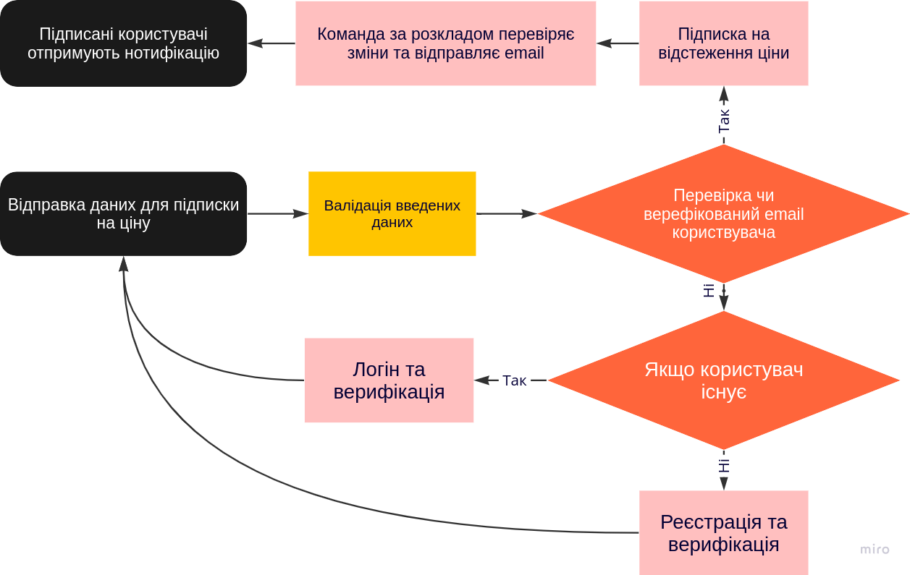

## Розгортання проекту
1. Клонувати проект
```bash
git clone https://github.com/renegade-d3v/PandaTeamTest
```
2. Зайти в папку проекту та скопіювати файл енвайрменту
```bash
cd PandaTeamTest
```
```bash
cp .env.example .env
```
3. Заповнити данні для відправки пошти
```bash
MAIL_MAILER=
MAIL_HOST=
MAIL_PORT=
MAIL_USERNAME=
MAIL_PASSWORD=
MAIL_ENCRYPTION=
MAIL_FROM_ADDRESS=
```
4. Зібрати та підняти проект
```bash
docker compose up -d
```
5. Зайти в контейнер з БД та створити користувача
```bash
docker exec -it app-db mysql -uroot -proot
```
```mysql
SHOW DATABASES;
CREATE DATABASE panda_db;
USE panda_db;
CREATE USER 'panda_app'@'%' IDENTIFIED BY '';
GRANT ALL PRIVILEGES ON panda_db.* TO 'panda_app'@'%';
FLUSH PRIVILEGES;
```
6. Встановити залежності composer
```bash
./composer install
```
7. Запустити міграції
```bash
./php-artisan migrate
```
8. Встановити залежності nodejs та запустити збірку для розробки
```bash
npm install
npm run dev
```
9. Зайти в контейнер та запустити cronjob
```bash
docker exec -it app bash
* * * * * /usr/bin/php /var/www/html/artisan schedule:run >> /dev/null 2>&1
```

API Endpoints:

| Method   | Headers  | URL             | Description      | Body |
| -------- |----------|-----------------|------------------|------|
| `POST`   | Authorization: Bearer        |`api/subscribe`  | Підписка на ціну |
```JSON
{
"announcement": "https://www.olx.ua/d/uk/obyavlenie/krossovki-etnies-metal-mulisha-barge-xl-IDJaSu2.html",
"email": "random.registered.mail@gmail.com"
}
```

| Method   | Headers | URL         | Description | Body |
| -------- |---------|-------------|-------------|------|
| `POST`   |         | `api/login` | Авторизація |
```JSON
{
    "email": "random.registered.mail@gmail.com",
    "password": "password"
}
```

| Method   | Headers | URL                | Description | Body |
| -------- |---------|--------------------|-------------|------|
| `POST`   |         | `api/registration` | Реєстрація  |
```JSON
{
    "email": "random.registered.mail@gmail.com",
    "password": "12121212",
    "password_confirmation": "12121212"
}
```

| Method | Headers | URL                | Description                     | Body |
|--------|---------|--------------------|---------------------------------|------|
| `POST` |   Authorization: Bearer       | `api/email/verification-notification` | Відправка листа для верифікації |


## Також доступний веб інтерфейс, с формою. http://localhost:8000/

## Схема роботи:

